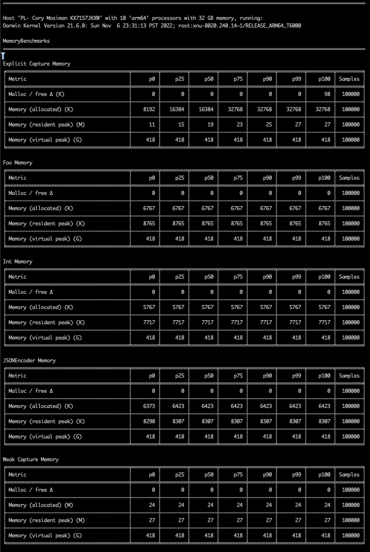
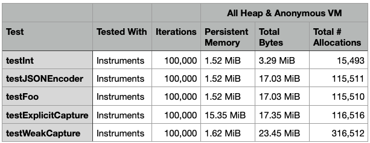

# swift-benchmark-testing

Trying to figure out how memory captured by this [package-benchmark](https://github.com/ordo-one/package-benchmark/) works.

Compare a benchmark run against the existing baseline: `swift package baseline compare`

# Reconciling Benchmarks w/Instruments

